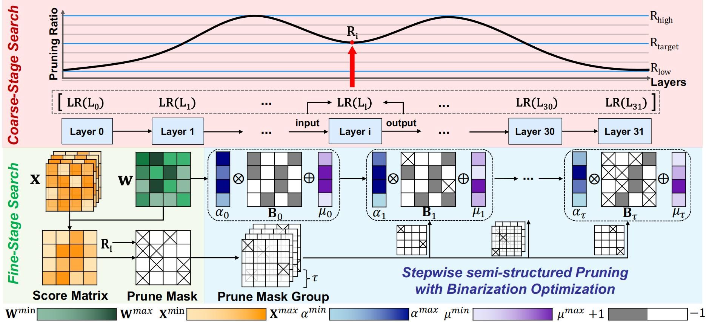
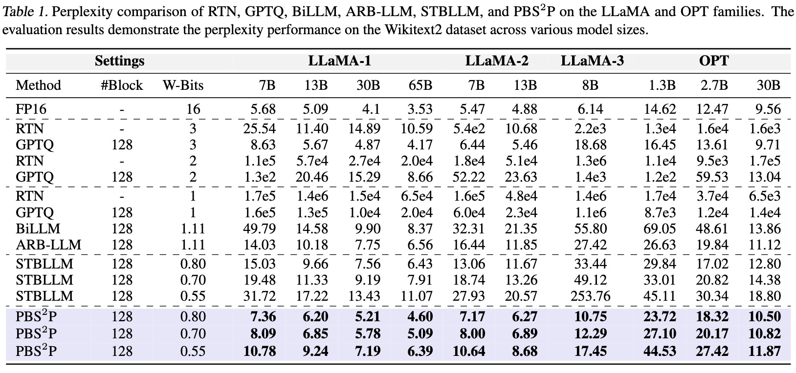
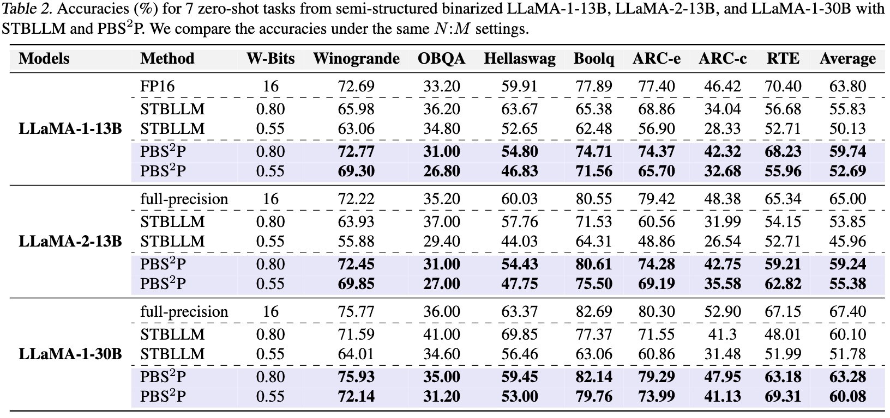

# Progressive Binarization with Semi-Structured Pruning for LLMs

Xianglong Yan, Tianao Zhang, [Zhiteng Li](https://zhitengli.github.io), and [Yulun Zhang](http://yulunzhang.com/).

[[arXiv](https://arxiv.org/abs/2502.01705
)] [[supplementary material](https://github.com/XIANGLONGYAN/PBS2P/releases/tag/v1)]  [models]

#### 🔥🔥🔥 News

- **2025-02-03:** This repo is released.

---  

> **Abstract:** Large language models (LLMs) have achieved remarkable success in natural language processing tasks, but their high computational and memory demands pose challenges for deployment on resource-constrained devices. Binarization, as an efficient compression method that reduces model weights to just 1 bit, significantly lowers both computational and memory requirements. Despite this, the binarized LLM still contains redundancy, which can be further compressed. Semi-structured pruning provides a promising approach to achieve this, which offers a better trade-off between model performance and hardware efficiency. However, simply combining binarization with semi-structured pruning can lead to a significant performance drop. To address this issue, we propose a **P**rogressive **B**inarization with **S**emi-**S**tructured **P**runing (PBS<sup>2</sup>P) method for LLM compression. We first propose a Stepwise semi-structured Pruning with Binarization Optimization (SPBO). Our optimization strategy significantly reduces the total error caused by pruning and binarization, even below that of the no-pruning scenario. Furthermore, we design a Coarse-to-Fine Search (CFS) method to select pruning elements more effectively. Extensive experiments demonstrate that PBS<sup>2</sup>P achieves superior accuracy across various LLM families and evaluation metrics, noticeably outperforming state-of-the-art (SOTA) binary PTQ methods. The code and models will be available at https://github.com/XIANGLONGYAN/PBS2P. 




---

## ⚒️ TODO

* [ ] Complete this repository

## 🔗 Contents

- [ ] Post-training quantization
- [ ] Models
- [x] [Results](#Results)
- [x] [Citation](#Citation)
- [x] [Acknowledgements](#Acknowledgements)

## 🔎 Results

<details>
<summary>PBS<sup>2</sup>P achieves superior perplexity performance on WikiText2 datasets. (click to expand)</summary>
<p align="center">
  
</p>

</details>

<details>
<summary>PBS<sup>2</sup>P achieves superior average accuracy on 7 zero-shot QA datasets. (click to expand)</summary>

<p align="center">
  
</p>

</details>

## Citation

If you find the code helpful in your research or work, please cite the following paper.

```
@article{yan2025progressivebinarizationsemistructuredpruning,
      title={Progressive Binarization with Semi-Structured Pruning for LLMs}, 
      author={Xianglong Yan and Tianao Zhang and Zhiteng Li and Yulun Zhang},
      year={2025},
      eprint={2502.01705},
      archivePrefix={arXiv},
      primaryClass={cs.LG},
      url={https://arxiv.org/abs/2502.01705}, 
}
```

## 💡 Acknowledgements

This work is released under the Apache 2.0 license.
